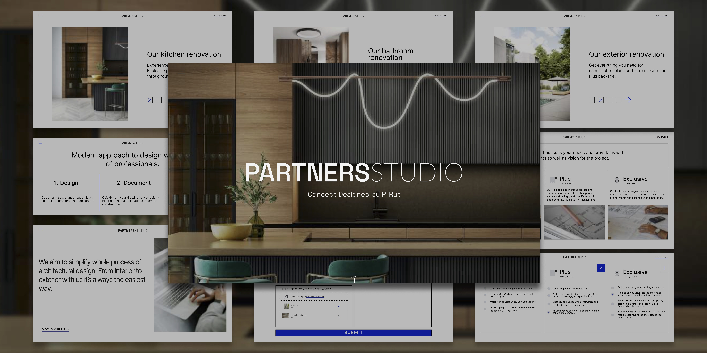

# PARTNERS STUDIO CONCEPT

This website project is designed to provide potential clients with information about architectural studio services and showcase their portfolio of completed projects. Visitors to the site can explore past work and read a detailed description of the services studio offer. The website also includes a contact form that allows clients to easily submit project details, blueprints, and photo files directly from the site. Design studio team can then use this information to calculate a personalized offer based on the chosen plan and uploaded files on thier server that are displayed on administration page.

This project was bootstrapped with [Create React App](https://github.com/facebook/create-react-app).

## Features

**Service Plans:** Clients can choose from three different service plans when submitting project details through contact form. They can also attach relevant files like blueprints, photos, or detailed project descriptions.

**Personalized Offers:** Employees, using the administration panel, receive and project inquiries. They can create personalized offers and send them directly to clients via email.

**Live Chat Support:** Site offers real-time chat support for instant assistance between clients and employees.

## Getting Started

### Installation

Clone the repository to your local machine.

git clone https://github.com/your-username/partners-studio-concept.git
cd partners-studio-concept

Install the required dependencies.

### `npm install`

## Running the App

In the project directory, run the following command to start the app in development mode:

### `npm start`

Open [http://localhost:3000](http://localhost:3000) to view the app in your browser.
The page will automatically reload if you make any edits, and you'll see any lint errors in the console.

### Accessing the Administration Panel

The administration panel is accessible at http://localhost:3000/admin.
Here, you can view a table of all inquiries submitted via the contact form.

## Live Chat

For the Live Chat feature, follow these steps:

In the livechat backend directory.

Run the Live Chat server:

### `npm start`

Open two seperate browser windows. One with INCOGNITO MODE (details of logged in user are stored in cookie) and one in regular.

In one window open the live chat bubble at [http://localhost:3000](http://localhost:3000) to access the chat from the client's view.

In second window alternatively, you can access the administration site of the chat at [http://localhost:3000/chat](http://localhost:3000/chat)to send messages and files between support and logged in user.
Use the following login details to access the support account:

Username: support
Password: 123
